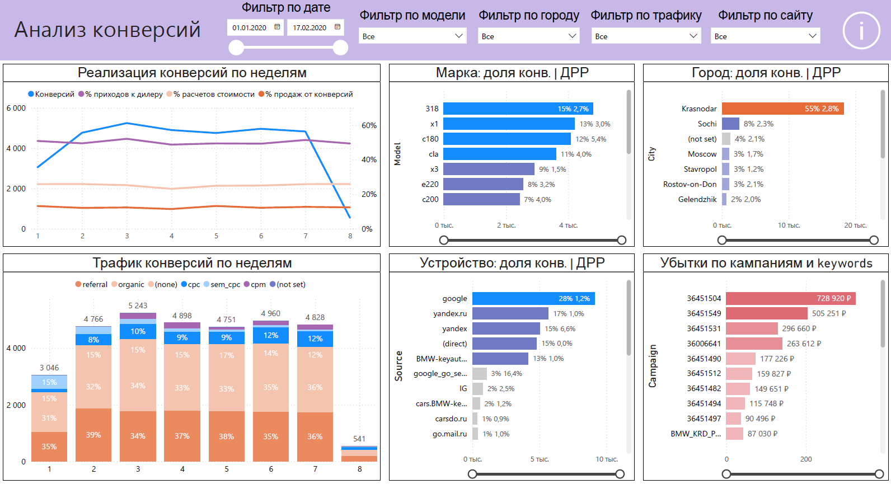
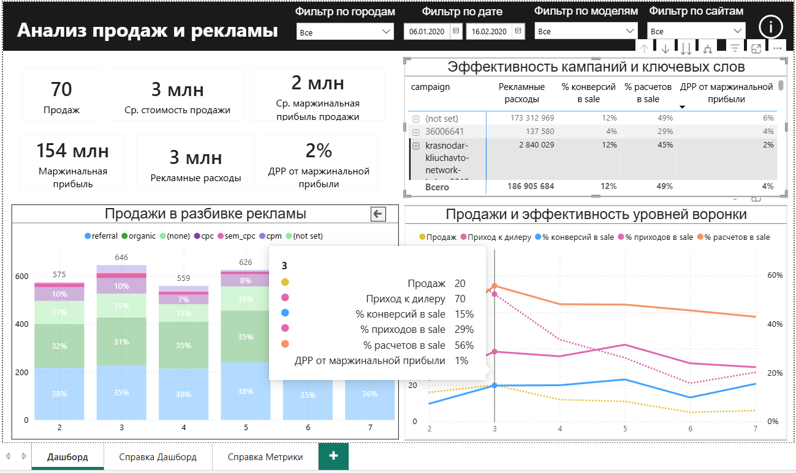
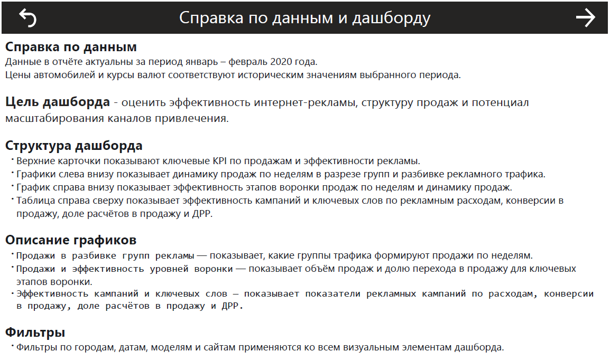
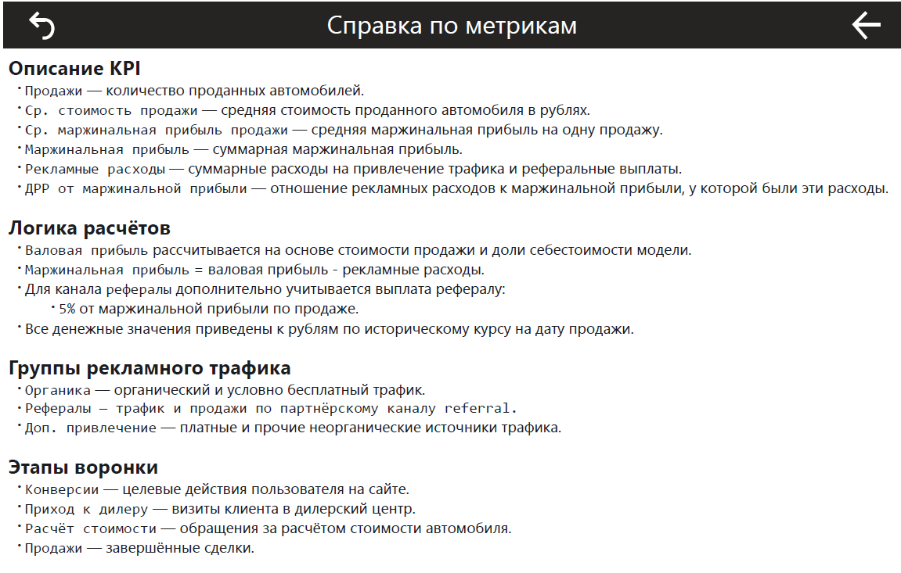
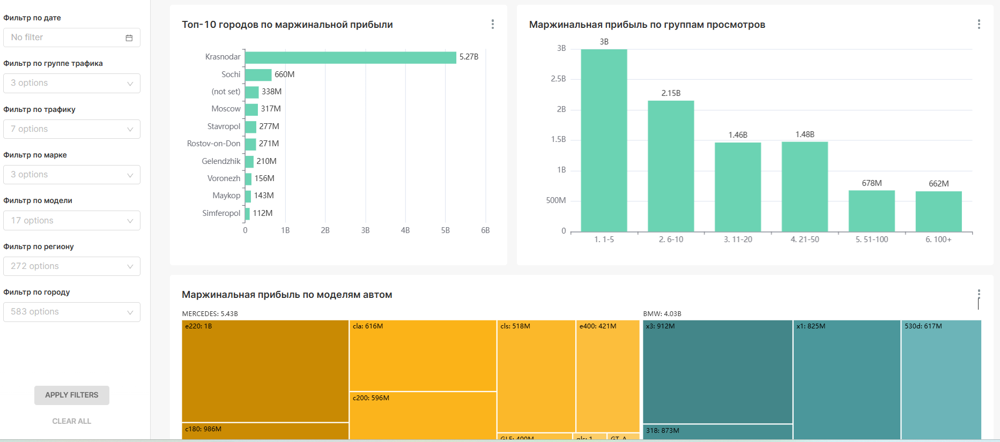
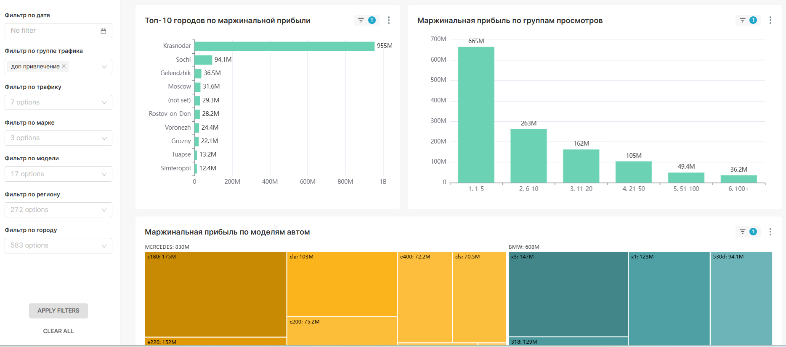
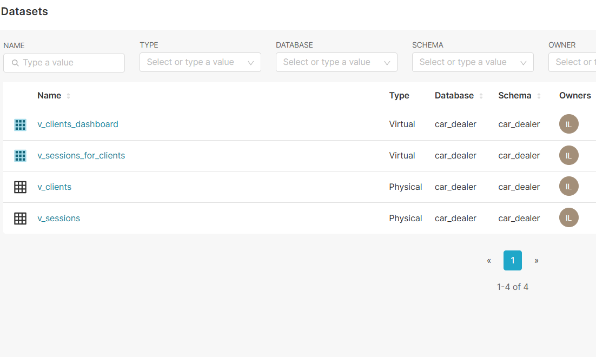
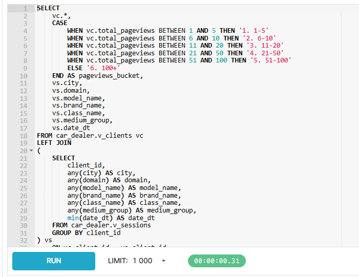
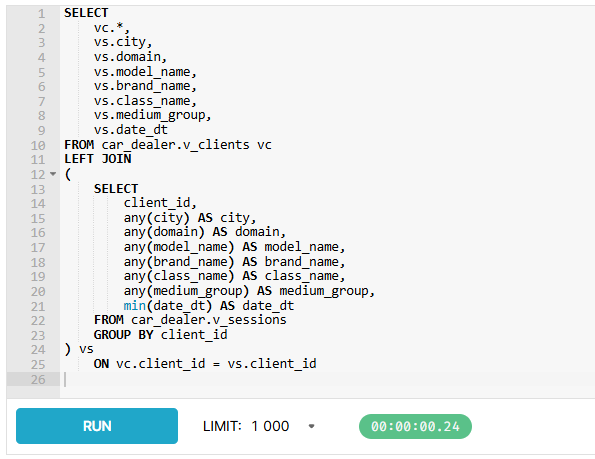

# End-to-End Analytics for Auto Dealerships

## Цели проекта
1. Создать эффективную и управляемую архитектуру данных для автодилера на основе данных из GA-сессий, CRM, продаж и справочников.
2. Собрать BI-дашборды для анализа продаж и интернет-рекламы, чтобы оценивать эффективность каналов и находить точки роста.

## Технологии

### Архитектура данных
MS SQL, Python (pandas, requests, pyodbc, openpyxl), Airflow, dbt, ClickHouse, Docker, Excel, Power Query

### BI-решения
Power BI (DAX) и Apache Superset

## Пайплайн проекта
1. Подготовка данных в Excel с помощью Power Query: из `источник.xlsx` в `CarDealer.xlsx`.

   

2. Перенос данных из Excel в `MS SQL` и одновременное сохранение raw-таблиц в `.csv`:

   [scripts/excel_to_db_csv.py](./scripts/excel_to_db_csv.py)

3. Разовая загрузка исторических курсов валют ЦБ РФ за период проекта:

   [scripts/backfill_currency_rates.py](./scripts/backfill_currency_rates.py)

4. Ежедневное обновление курсов валют и пересборка `dbt` через `Airflow`:

   [airflow/dags/auto_dealer_dag.py](./airflow/dags/auto_dealer_dag.py)

5. Построение витрин в `dbt`:

   [car_dealer_dbt](./car_dealer_dbt)

6. Создание таблиц в `ClickHouse` и загрузка в них готовых BI-витрин:

   [scripts/load_clickhouse_views.py](./scripts/load_clickhouse_views.py)

## dbt-слои

### `staging`
Слой приведения raw-источников к удобному аналитическому виду.

В этом слое:
- переименовываются поля и приводятся типы данных;
- задаются тесты `not_null`, `unique`, `relationships`, `accepted_values`;
- очищаются и стандартизируются справочники.

Основные модели:
- `stg_ga_sessions`
- `stg_crm_events`
- `stg_sales`
- `stg_models`
- `stg_brands`
- `stg_classes`
- `stg_mediums`
- `stg_medium_groups`
- `stg_currencies`
- `stg_currency_rates`
- `stg_clients`

### `intermediate`
Слой промежуточной бизнес-логики.

В этом слое:
- связываются продажи с сессиями;
- рассчитываются `price_rub`, `gross_profit_rub`, `contribution_margin_rub`;
- учитывается выплата рефералу `5%` от маржинальной прибыли по продаже;
- формируются `final_ad_cost` и `final_contribution_margin_rub`;
- подтягиваются бренд, класс, валюта и другие аналитические признаки.

Основные модели:
- `int_models_with_currency`
- `int_sales_with_session`
- `int_sales_enriched`
- `int_sales`
- `int_session_crm`

### `views`
Итоговые BI-витрины для анализа и визуализации.

Основные витрины:
- `dbo.v_sessions` — главная витрина по сессиям, продажам, CRM-событиям и рекламным расходам;
- `dbo.v_clients` — клиентская агрегированная витрина;
- `dbo.v_medium` — справочник medium для сортировки и фильтрации;
- `dbo.v_medium_groups` — справочник групп рекламного трафика.

## Airflow
`Airflow` запущен в `Docker` и доступен по адресу:

[http://localhost:8081](http://localhost:8081)

### Использование
В проекте `Airflow` отвечает за:
- ежедневную догрузку актуальных курсов валют с сайта ЦБ РФ;
- запуск `dbt build`.

## ClickHouse
`ClickHouse` поднят как отдельный сервис проекта в `Docker`.

### Порты
- HTTP: `8124`
- Native: `9001`

### Доступы
- host: `127.0.0.1`
- database: `car_dealer`
- user: `analytics`
- password: `analytics`

### DDL
DDL-скрипты для таблиц `ClickHouse` лежат в папке:

[sql/clickhouse](./sql/clickhouse)

### Важные технические нюансы загрузки
1. Для `SSMS`-CSV с `NULL` используется:
   `--format_csv_null_representation='NULL'`
2. Для широкой витрины `v_sessions` используется `;` как разделитель.
3. При повторной полной загрузке таблицы лучше очищать через `TRUNCATE TABLE`.

## BI

### Power BI
В `Power BI` собран основной управленческий дашборд по продажам и эффективности интернет-рекламы.

Ключевые блоки дашборда:
- KPI по продажам, маржинальной прибыли, рекламным расходам и `ДРР`;
- продажи по группам рекламного трафика;
- эффективность этапов воронки продаж;
- таблица эффективности кампаний и ключевых слов.

Дашборд фокусируется на продажах, маржинальной прибыли, `ДРР` и эффективности каналов привлечения.











### Superset
`Superset` доступен по адресу:

[http://localhost:8089/login/](http://localhost:8089/login/)

Используется для:
- подключения к `ClickHouse`;
- построения альтернативного BI-дашборда;
- анализа городов, моделей, групп просмотров страниц и маржинальной прибыли.

В `Superset` собран альтернативный аналитический дашборд с акцентом на исследовательские срезы по городам, моделям и поведенческим группам клиентов.











## Результаты проекта
- собрана end-to-end архитектура: `Excel -> MS SQL -> dbt -> ClickHouse -> Power BI / Superset`;
- рассчитаны продажи, валовая и маржинальная прибыль, рекламные расходы и `ДРР`;
- выделены 3 группы трафика: `органика`, `рефералы`, `доп. привлечение`;
- построены витрины и дашборды для двух BI-инструментов;
- найдены точки для оптимизации рекламных кампаний и оценки потенциала масштабирования каналов привлечения.


## Docker-сервисы проекта
Текущий `docker-compose` поднимает:
- `airflow_autodealer` — `Airflow`;
- `airflow_postgres_autodealer` — `Postgres` для `Airflow`;
- `clickhouse_autodealer` — `ClickHouse`;
- `superset_autodealer` — `Superset`;
- `superset_postgres_autodealer` — `Postgres` для `Superset`.

## Как запустить проект

### 1. Поднять Docker-сервисы
Из корня проекта:

```powershell
docker compose up -d --build
```

Перед запуском убедитесь, что локальный `MS SQL Server` доступен по параметрам, указанным в `docker-compose.yaml`.

### 2. Загрузить raw-данные из Excel в MS SQL
```powershell
python scripts/excel_to_db_csv.py
```

### 3. Загрузить исторические курсы валют
```powershell
python scripts/backfill_currency_rates.py
```

### 4. Пересобрать `dbt`-модели
```powershell
docker exec airflow_autodealer bash -lc "cd /opt/airflow/project && dbt build --project-dir car_dealer_dbt --profiles-dir car_dealer_dbt"
```

### 5. Перезагрузить витрины в ClickHouse
```powershell
python scripts/load_clickhouse_views.py
```

### 6. Открыть BI-инструменты
- `Airflow`: [http://localhost:8081](http://localhost:8081)
- `ClickHouse HTTP`: [http://localhost:8124](http://localhost:8124)
- `Superset`: [http://localhost:8089/login/](http://localhost:8089/login/)
