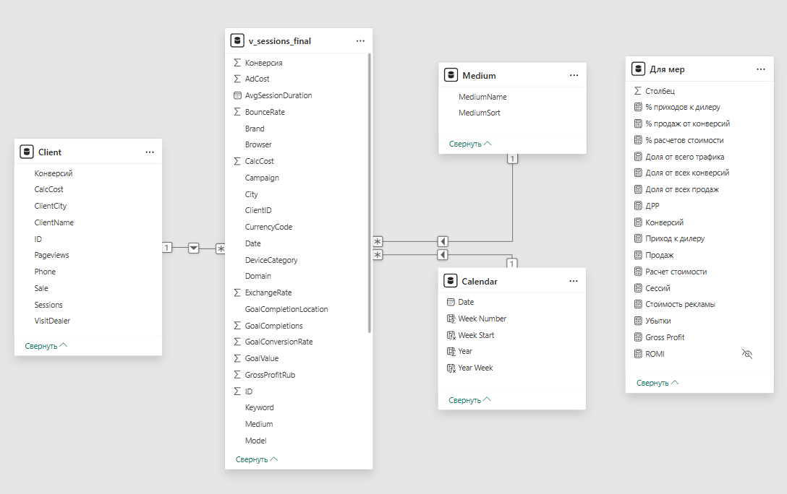
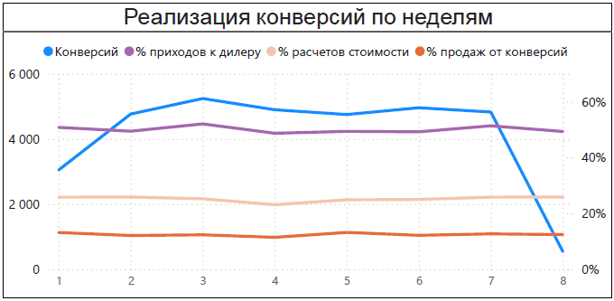

# Сквозная аналитика автодилера

## Цель проекта
1. Объединение данных Google Analytics с внутренними данными о продажах и справочником, а также настройка выгрузки курсов валют
2. Создание дашборда для оценки ROI рекламных каналов и выявления убыточных кампаний в Power BI
3. Анализ выручки автодиреа в Superset

## Основные используемые технологии:
Power BI (Power Query, DAX, Power View), Superset, SQL Server, Views, Excel, Python (requests, pyodbc, pandas, time), Парсинг

## Структура базы данных:
**Основные таблицы:**
* Client - таблица с данными о клиентах
* Session - таблица с данными по сессиям с Google Analytics и воронкой их реализации

**Справочники:**
* Model - справочник моделей авто 
* Medium - справочник типов рекламы
* CurrencyRates - справочник курсов валют по дням

**Процесс заполнения CurrencyRates полностью автоматизирован с помощью скриптов Python:**
  1. Скрипт на парсинг курсов валют с сайта ЦБ РФ за выбранные даты
  2. Скрипт на ежедневный парсинг текущих курсов валют с сайта ЦБ РФ

**Представление v_sessions_final** - денормализует данные по моделям авто и курсам валют, а также расчитывает метрики

#### Диаграмма базы данных Car_Dealer_GA_CRM

## Структура Power BI
**Модель данных:**
  - Две основные таблицы и справочник Medium
  - Таблица, созданая в Power Query PBI, для агрегации по неделям Calendar
  - Набор мер

**Фильтры:**
  - по дате
  - по марке и модели
  - по региону и городу
  - по типу трафика, кампании и ключевым словам
  - по устройству, браузеру и сайту

**Визуализации:**
1. "Реализация конверсий по неделям" - отражает изменение кол-ва конверсий и их реализацию в течении времени, 'воронка продаж в линейном графике по неделям'.

2. "Трафик конверсий по неделям" - отражает источники трафика и их эффективность в течении времени.

3. "Марка: доля конв. | ДРР" - отражает кол-во и эффективность конверсий и продаж марок и моделей авто.

4. "Устройство: доля конв. | ДРР" - отражает кол-во и эффективность конверсий и продаж по типам устройств, браузерам и сайтам.

5. "Город: доля конв. | ДРР" - отражает кол-во и эффективность конверсий и продаж по городам, кампаниям и ключевым словам.

6. "Убытки по кампаниям и keywords" - отражает убыточные кампании и ключевые слова.

**Справка по графикам и метрикам:**

